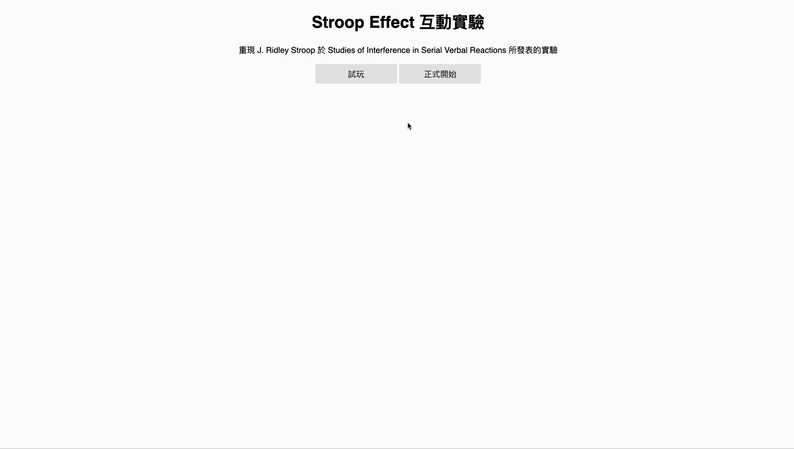
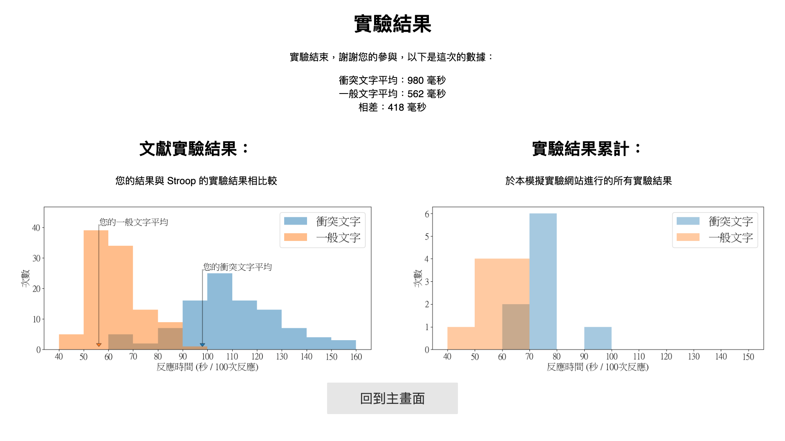
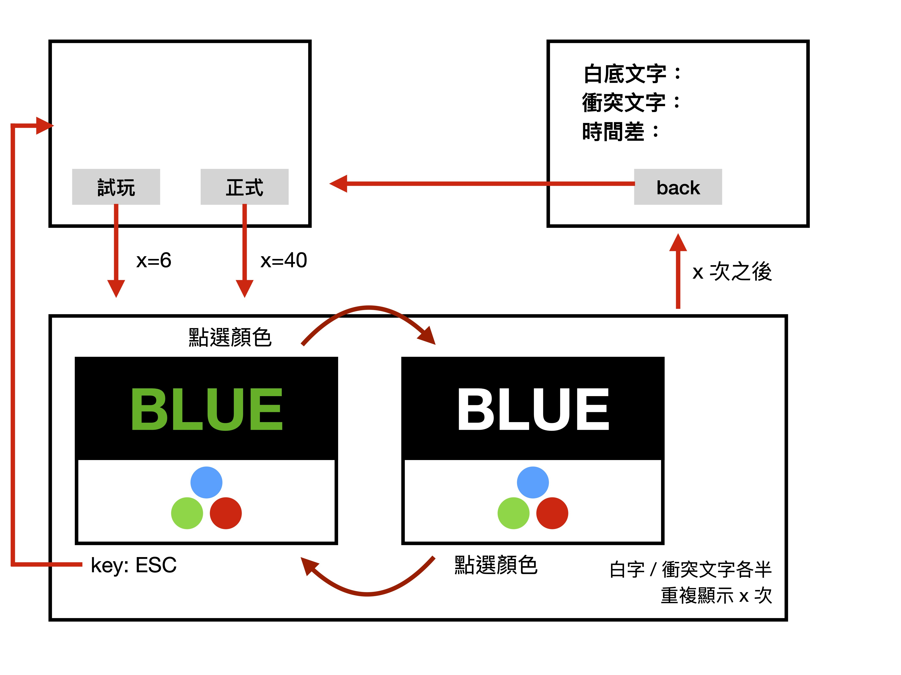

# Stroop Effect Game

(In traditional Chinese)\
Reproduce experiment II in studies of J. Ridley Stroop, published in *Studies of Interference in Serial Verbal Reactions*. 




Example of experiment result:




## Environment Setup

This app is developed under Python 3, tested with Google Chrome 80.0.3987.87, macOS 10.15.

### Install requirements

```bash
pip install -r requirements.txt
```

## Usage

### Run the application

```bash
flask run
```

### Spec


## Customization

Please modify `config.toml`.

- Setting
    - `test`: 「試玩」有幾次
    - `experiment`: 「正式開始」有幾次
    - `filter`: 是否篩除 outlier
    - `outlier_over_std`: 刪除多少標準差以外的 data，適用於 `filter` 有效時
    - `min_data_filter`: 在 data 數量大於多少時，篩除 outlier，適用於 `filter` 有效時
    - `output_file`:  實驗結果以 `.csv` 格式記錄於此
- Plotting: `Matplotlib` 的設定檔
- Wording: 網頁顯示的文字
