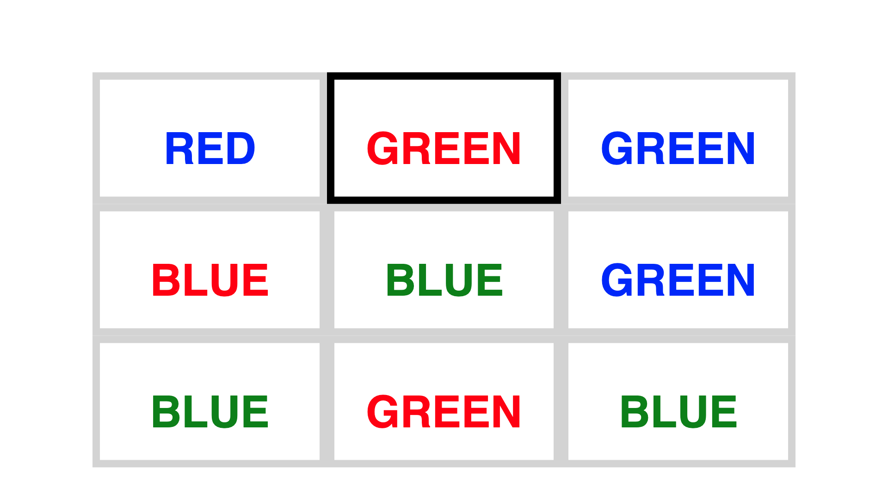
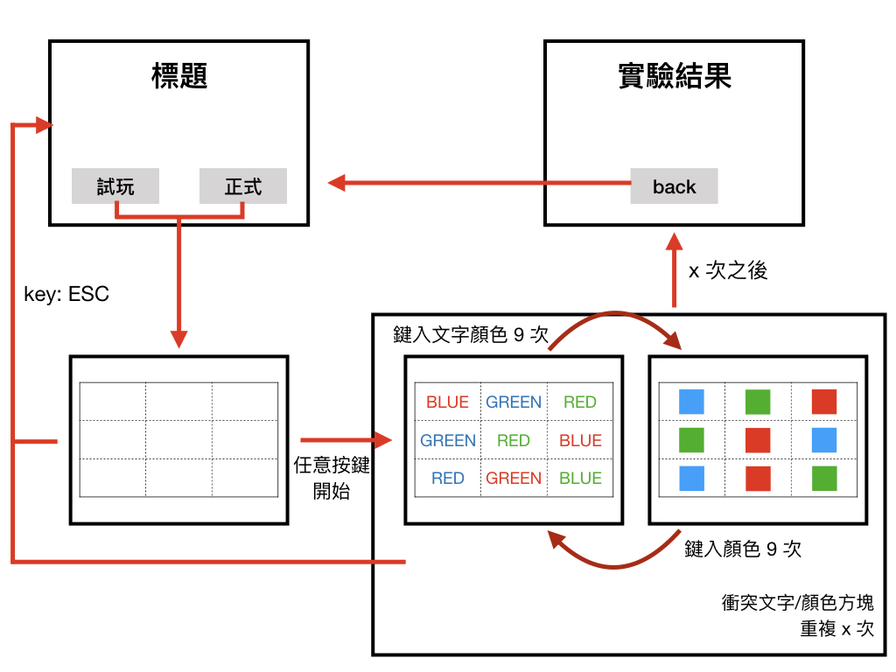

# Stroop Effect Game

Mimicking experiment I in studies of J. Ridley Stroop, published in *Studies of Interference in Serial Verbal Reactions*. 
(In traditional Chinese)



Example of experiment result:


## Environment Setup

This app is developed under Python 3, tested with Google Chrome, macOS 10.15.

### Install requirements

```bash
pip install -r requirements.txt
```

### customize

modify `config.toml`

- `test': how many runs in pre-testing
- `experiment`: how many runs in formal testing
- `filter`: discard outliers (in measured time difference)
- `outlier_over_std`: tolerance for data, deviating from mean
- `min_data_filter`: discard outliers when collected data > this value


## Usage

### run the application

```bash
flask run
```

### application spec

